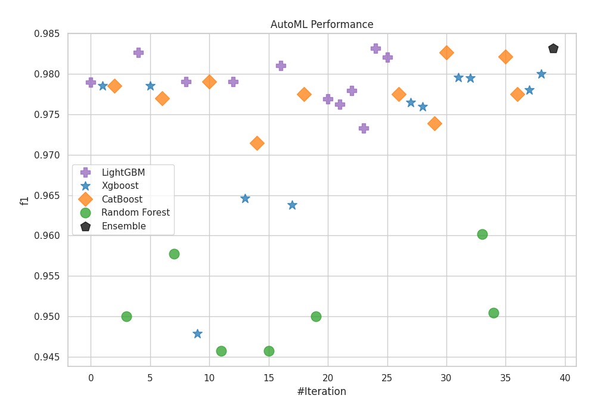
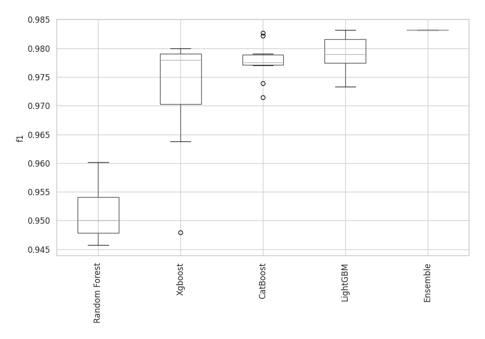
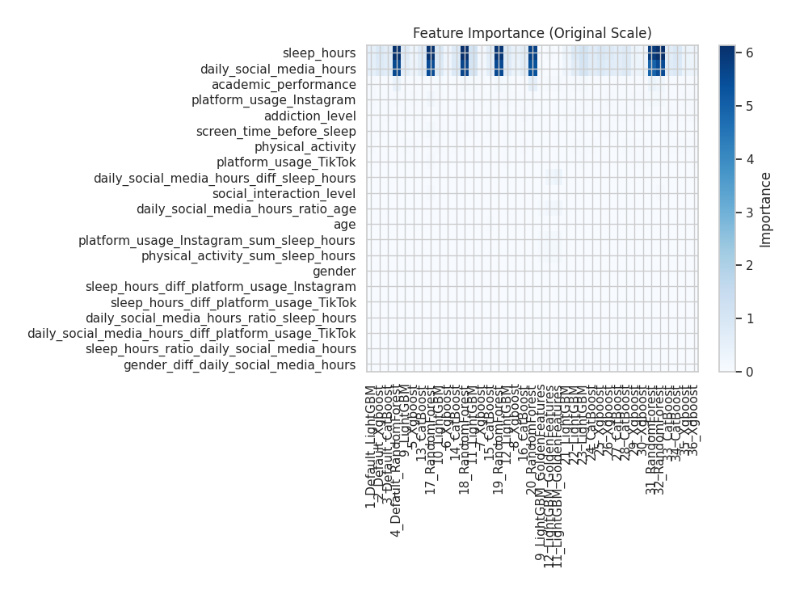
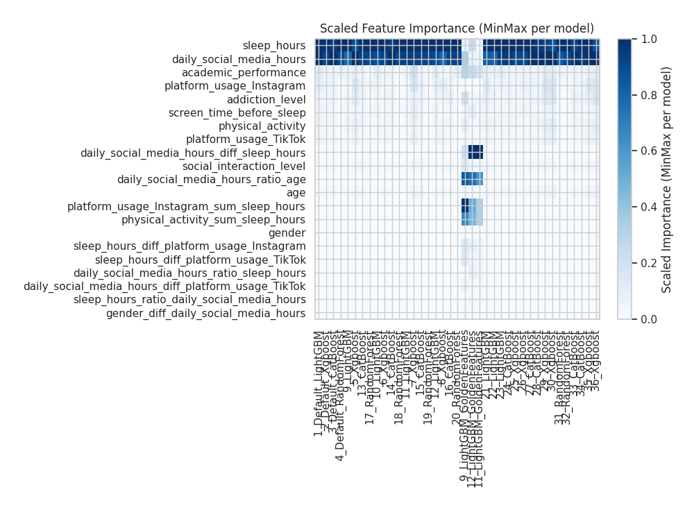
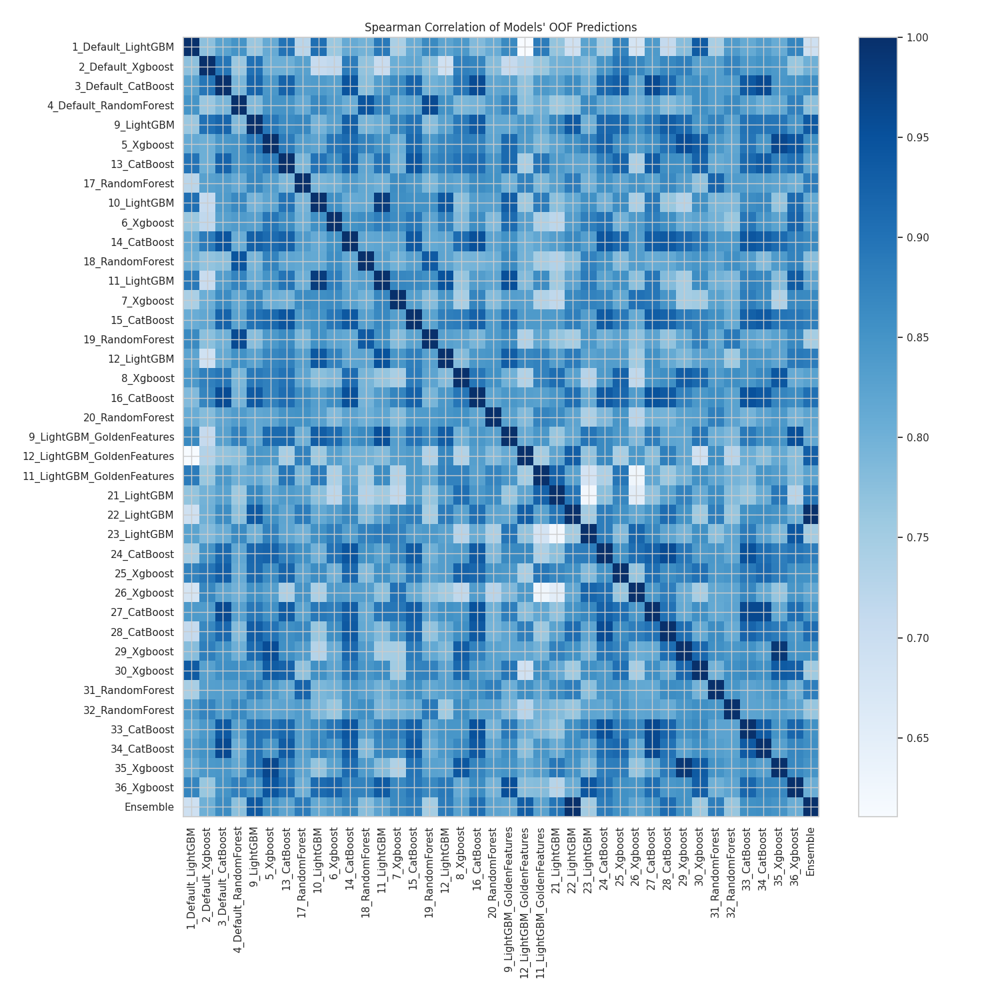

# AutoML Leaderboard

| Best model   | name                                                               | model_type    | metric_type   |   metric_value |   train_time |   single_prediction_time |
|:-------------|:-------------------------------------------------------------------|:--------------|:--------------|---------------:|-------------:|-------------------------:|
|              | [1_Default_LightGBM](1_Default_LightGBM/README.md)                 | LightGBM      | f1            |       0.978925 |        12.33 |                   0.0158 |
|              | [2_Default_Xgboost](2_Default_Xgboost/README.md)                   | Xgboost       | f1            |       0.978523 |        14.4  |                   0.0178 |
|              | [3_Default_CatBoost](3_Default_CatBoost/README.md)                 | CatBoost      | f1            |       0.978523 |         4.13 |                   0.0176 |
|              | [4_Default_RandomForest](4_Default_RandomForest/README.md)         | Random Forest | f1            |       0.950051 |         6.02 |                   0.0796 |
|              | [9_LightGBM](9_LightGBM/README.md)                                 | LightGBM      | f1            |       0.982622 |         7.82 |                   0.0168 |
|              | [5_Xgboost](5_Xgboost/README.md)                                   | Xgboost       | f1            |       0.978478 |         6.04 |                   0.0183 |
|              | [13_CatBoost](13_CatBoost/README.md)                               | CatBoost      | f1            |       0.976987 |         4.52 |                   0.0182 |
|              | [17_RandomForest](17_RandomForest/README.md)                       | Random Forest | f1            |       0.957732 |         6.2  |                   0.0788 |
|              | [10_LightGBM](10_LightGBM/README.md)                               | LightGBM      | f1            |       0.978992 |         6.04 |                   0.0171 |
|              | [6_Xgboost](6_Xgboost/README.md)                                   | Xgboost       | f1            |       0.947906 |         5.44 |                   0.0174 |
|              | [14_CatBoost](14_CatBoost/README.md)                               | CatBoost      | f1            |       0.979014 |         4.42 |                   0.0206 |
|              | [18_RandomForest](18_RandomForest/README.md)                       | Random Forest | f1            |       0.945768 |         6.24 |                   0.0773 |
|              | [11_LightGBM](11_LightGBM/README.md)                               | LightGBM      | f1            |       0.979014 |         9.32 |                   0.0154 |
|              | [7_Xgboost](7_Xgboost/README.md)                                   | Xgboost       | f1            |       0.964583 |         5.77 |                   0.0178 |
|              | [15_CatBoost](15_CatBoost/README.md)                               | CatBoost      | f1            |       0.971429 |         7.7  |                   0.0188 |
|              | [19_RandomForest](19_RandomForest/README.md)                       | Random Forest | f1            |       0.945713 |         6.41 |                   0.0836 |
|              | [12_LightGBM](12_LightGBM/README.md)                               | LightGBM      | f1            |       0.981013 |        11.54 |                   0.0166 |
|              | [8_Xgboost](8_Xgboost/README.md)                                   | Xgboost       | f1            |       0.963806 |         7.12 |                   0.0172 |
|              | [16_CatBoost](16_CatBoost/README.md)                               | CatBoost      | f1            |       0.977499 |         4.36 |                   0.0166 |
|              | [20_RandomForest](20_RandomForest/README.md)                       | Random Forest | f1            |       0.95     |         6.38 |                   0.0759 |
|              | [9_LightGBM_GoldenFeatures](9_LightGBM_GoldenFeatures/README.md)   | LightGBM      | f1            |       0.976915 |         9.38 |                   0.0397 |
|              | [12_LightGBM_GoldenFeatures](12_LightGBM_GoldenFeatures/README.md) | LightGBM      | f1            |       0.976253 |        11.07 |                   0.0372 |
|              | [11_LightGBM_GoldenFeatures](11_LightGBM_GoldenFeatures/README.md) | LightGBM      | f1            |       0.977895 |        11.99 |                   0.0387 |
|              | [21_LightGBM](21_LightGBM/README.md)                               | LightGBM      | f1            |       0.973312 |         8.23 |                   0.0156 |
| **the best** | [22_LightGBM](22_LightGBM/README.md)                               | LightGBM      | f1            |       0.98314  |         7.58 |                   0.0149 |
|              | [23_LightGBM](23_LightGBM/README.md)                               | LightGBM      | f1            |       0.982068 |         9.81 |                   0.015  |
|              | [24_CatBoost](24_CatBoost/README.md)                               | CatBoost      | f1            |       0.977475 |         5.21 |                   0.0173 |
|              | [25_Xgboost](25_Xgboost/README.md)                                 | Xgboost       | f1            |       0.976477 |         8.65 |                   0.0175 |
|              | [26_Xgboost](26_Xgboost/README.md)                                 | Xgboost       | f1            |       0.975941 |         7.92 |                   0.0192 |
|              | [27_CatBoost](27_CatBoost/README.md)                               | CatBoost      | f1            |       0.973904 |         5.51 |                   0.0176 |
|              | [28_CatBoost](28_CatBoost/README.md)                               | CatBoost      | f1            |       0.982659 |         5.1  |                   0.0177 |
|              | [29_Xgboost](29_Xgboost/README.md)                                 | Xgboost       | f1            |       0.979528 |         7.61 |                   0.0181 |
|              | [30_Xgboost](30_Xgboost/README.md)                                 | Xgboost       | f1            |       0.979484 |         7.22 |                   0.0199 |
|              | [31_RandomForest](31_RandomForest/README.md)                       | Random Forest | f1            |       0.960166 |         7.38 |                   0.0771 |
|              | [32_RandomForest](32_RandomForest/README.md)                       | Random Forest | f1            |       0.950485 |         7.27 |                   0.0768 |
|              | [33_CatBoost](33_CatBoost/README.md)                               | CatBoost      | f1            |       0.982124 |         5.15 |                   0.0175 |
|              | [34_CatBoost](34_CatBoost/README.md)                               | CatBoost      | f1            |       0.977475 |         6.27 |                   0.0237 |
|              | [35_Xgboost](35_Xgboost/README.md)                                 | Xgboost       | f1            |       0.977964 |         8.5  |                   0.0234 |
|              | [36_Xgboost](36_Xgboost/README.md)                                 | Xgboost       | f1            |       0.979979 |         7.8  |                   0.0213 |
|              | [Ensemble](Ensemble/README.md)                                     | Ensemble      | f1            |       0.98314  |         4.39 |                   0.0173 |

### AutoML Performance

### AutoML Performance Boxplot

### Features Importance (Original Scale)

### Scaled Features Importance (MinMax per Model)

### Spearman Correlation of Models

